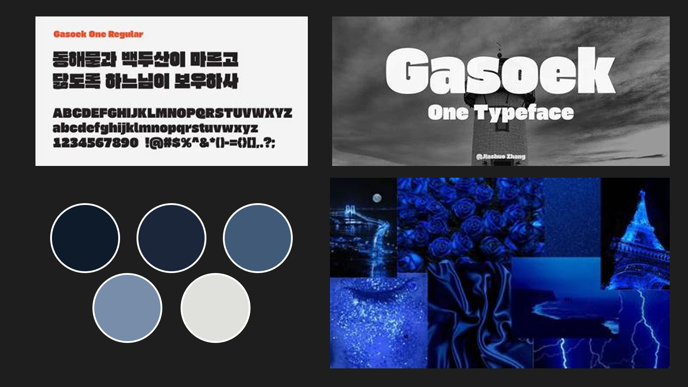
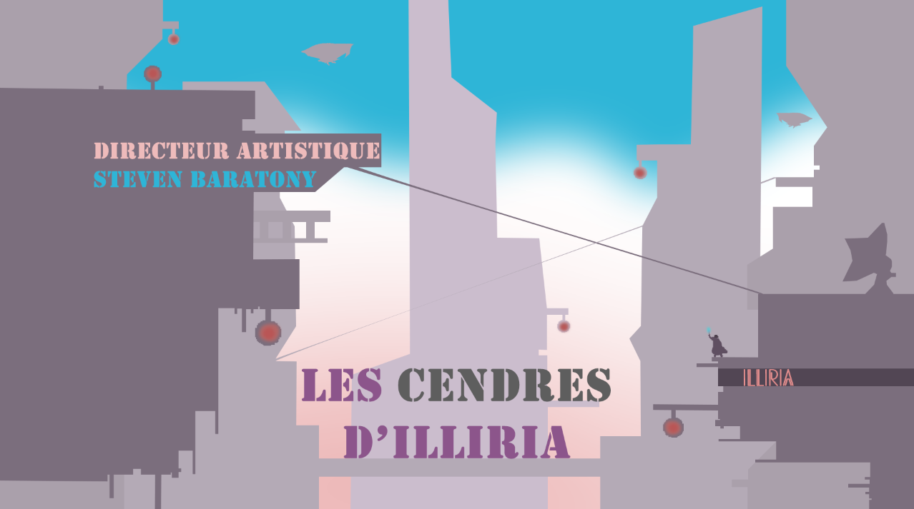
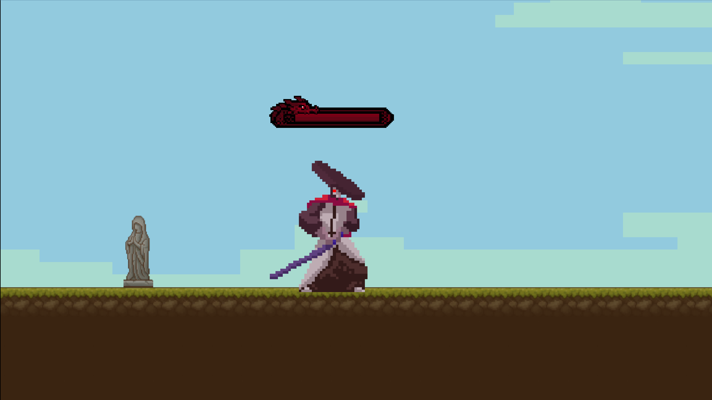
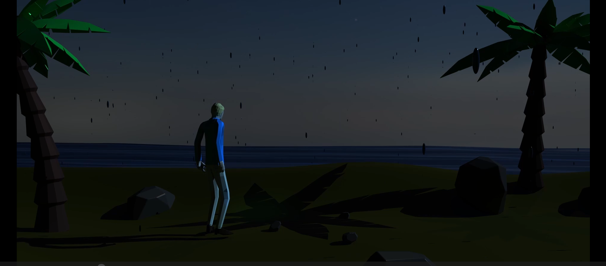
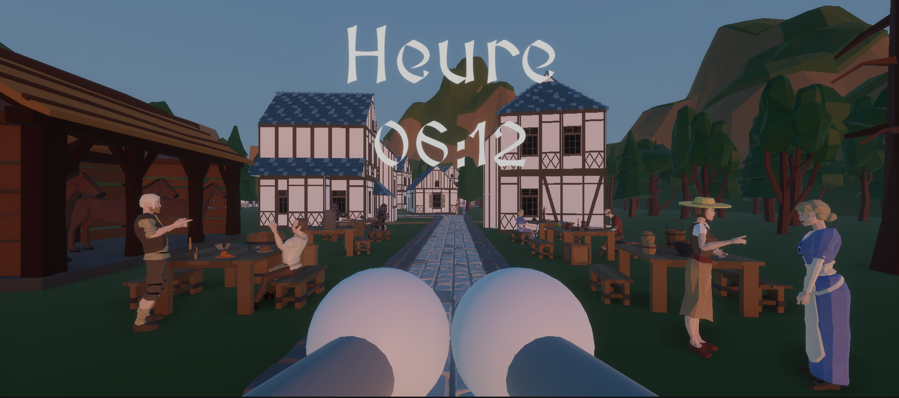

# Planification de portfolio

## Style du portfolio

### Mes compétences 

- Réaliser et tourner des vidéos
- Animer des créations 2D et 3D
- Concevoir des compositions sonores et visuelles interactives
- Assembler des environnements de réalité virtuelle
- Penser et optimiser l’expérience utilisateur
- Créer des univers immersifs et interactifs

### Logiciel connu

- Visual Studio Code
- Photoshop
- Illustrator
- Lightroom
- After Effects
- Davinci Resolve
- Maya
- Unity
- Reaper
- Max
- Microsoft Teams

### Langage de programmation

- HTML
- CSS
- JavaScript
- SQL

### Objectif de carrière

Je souhaite obtenir un poste d'animation 3d dans le domaine des jeux vidéo ou des films d'animation, où je pourrai utiliser mes compétences en animation et en montage vidéo.

## Projet 1

### Nom de votre projet:
Les cendres d'iliria

### Mention académique ou personnel:
académique

### Réalisé dans le cadre du cours:
D'ilustration numérique

### Individuel ou en équipe:
équipe

### Nom de vos coéquipiers:
Jérémy Thériault

### Votre ou vos rôle(s) dans le projet:
faire 6 image chacun

### Logiciels ou techniques utilisées:
Photoshop et vectoriel

### Catégorie du projet:
Illustrations

### Description courte du projet (Résumé en 1 phrase):
Illustration de 6 image en vectoriel pour un film fictif 

### Description du projet (Qu'est-ce que le prof vous a demandé de réaliser?) (2 phrases):
créé un intro de film entièrement en vectoriel et de faire 6 image chacun. On devait aussi créé une histoire a notre projet

### Description de votre projet (Qu'est-ce que vous avez fait?) (2 phrases):
On a créé une histoire comme demandé mais on a décidé de faire notre projet dans un style semblable au **pixel art**. Puisque le vectoriel n'est pas fait pour le **pixel art** c'était assez long de faire les personnages et les objets.

### Lien vers la documentation de votre projet (photos, vidéos, extraits sonores, ...):

## Projet 2

### Nom de votre projet:
Shogun

### Mention académique ou personnel:
académique

### Réalisé dans le cadre du cours:
Intéractivité ludique

### Individuel ou en équipe:
Individuel

### Votre ou vos rôle(s) dans le projet:
code du jeu, **level design**, son du jeu

### Logiciels ou techniques utilisées:
Godot

### Catégorie du projet:
jeu vidéo

### Description courte du projet (Résumé en 1 phrase):
création d'un jeu vidéo avec des portes et des clés intéractif

### Description du projet (Qu'est-ce que le prof vous a demandé de réaliser?) (2 phrases):
créé une expérience interactive avec trois niveaux différent. Il fallait aussi avoir des objets interactif spécifique et une attribution de touche grace a godot

### Description de votre projet (Qu'est-ce que vous avez fait?) (2 phrases):
j'ai fait un jeu de combat platformer dans le style de blasphemous avec trois niveau de plus en plus dur, le but est de tuer le dernier boss pour gagner

### Lien vers la documentation de votre projet (photos, vidéos, extraits sonores, ...):
lien github: https://github.com/t1ctac19/lucas_bonneau_godot_tp3

## Projet 3

### Nom de votre projet:
Seul

### Mention académique ou personnel:
Académique

### Réalisé dans le cadre du cours:
Animation 3d, traitement audiovisuel, audio 2

### Individuel ou en équipe:
Individuel

### Votre ou vos rôle(s) dans le projet:
Animation 3d et musique

### Logiciels ou techniques utilisées:
Maya, Max msp et Touchdesigner

### Catégorie du projet:
expérience multimédias 

### Description courte du projet (Résumé en 1 phrase):
créé une expérience multimédias visuel et sonore, controlée par Max et touchdesigner

### Description du projet (Qu'est-ce que le prof vous a demandé de réaliser?) (2 phrases):
On devait créé une grosse performance de 5 à 10min qui combinais plusieurs cours, on devait avoir un projet d'animation 3d, une piste audio interactive grâce à Max et combiner le tout dans Touchdesigner. Une main devais controler les scènes de Touch grâce à une caméra et l'autre devais controler Max grâce à un controleur MIDI.

### Description de votre projet (Qu'est-ce que vous avez fait?) (2 phrases):
J'ai décidé d'animer un personnage qui marche seul sur une plage. Le thème de la plage et de la solitude était donc aussi mon thème dans Max et Touch.

### Lien vers la documentation de votre projet (photos, vidéos, extraits sonores, ...):
lien github:

## Projet 4

### Nom de votre projet:
Messenger rise

### Mention académique ou personnel:
Académique

### Réalisé dans le cadre du cours:
Réalité mixte

### Individuel ou en équipe:
Équipe

### Nom de vos coéquipiers:
Jérémy Thériault, Zackary Warren

### Votre ou vos rôle(s) dans le projet:
**level design** de la deuxième ville et de la zone de victoire, animation de tout les personnages, placement de beaucoup d'assets dans les villes

### Logiciels ou techniques utilisées:
Unity

### Catégorie du projet:
Jeu vidéo 

### Description courte du projet (Résumé en 1 phrase):
Créé un jeu interactif en vr 

### Description du projet (Qu'est-ce que le prof vous a demandé de réaliser?) (2 phrases):
On devais créé un jeu en réalité virtuelle en équipe, le sujet était libre. Le jeu devait absolument contenir plusieurs objet interactif.

### Description de votre projet (Qu'est-ce que vous avez fait?) (2 phrases):
On a créé un jeu de livreur de lettre dans un monde médiéval, le but du joueur est d'aller porter un certains nombres de lettres pour débloquer la prochaine zone, la dernière zone est le chateau du roi. Les lettres sont marqué par des faisceaux lumineux et l'endroit pour aller le porter aussi 

### Lien vers la documentation de votre projet (photos, vidéos, extraits sonores, ...):
lien github: https://github.com/t1ctac19/travail_3_realiter_mixte

## Processus de création

Je vais expliquer comment j'ai réaliser le projet **messenger rise** 

1- on a créé un trello pour organisé nos idées et on a séparé nos tache en même temps
2- Ensuite on a commencé chacun par créé la base de nos maps respectives
3- J'ai ensuite commencé par rassemblé des assets en groupe pour facilité la notre vie (table avec objet, grange avec objet, etc)
4- J'ai fais les animations de tout les personnages et je les ai dispersé dans les cartes de tout le monde
5- Ensuite j'ai fais les hitbox de tout mes objets 
6- Jérémy et Zackary on fait leur map et le code du jeu
7- j'ai finalisé les maps de tout le monde en ajoutant les assets et en faisant des tests de hitbox avec Jérémy
8- J'ai ensuite créé la map de victoire
9- A la fin on a tous travaillé ensemble pour s'assuré que le vr du jeu marchais bien 

## Web

### Gestion des données

Base de données en ligne (gratuite)

### Animations

Anime.js

### Structure de navigation

One-pager avec pop-up

### Hébergement

GitHub Pages

